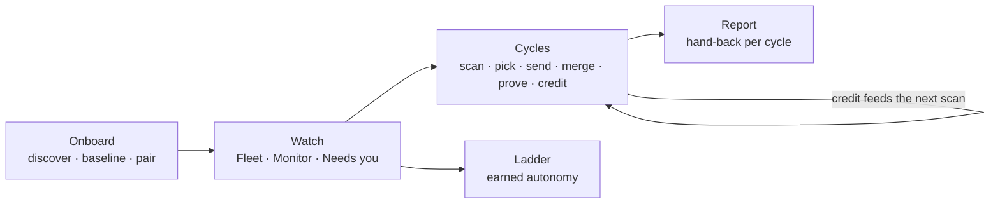

# Afterlife: module documentation

Afterlife (the codebase is still named Belay) sets up AI agents on a company's GitLab projects and watches them
through the work that comes after code: security, review, testing, compliance, releases, upgrades. Two ideas run
through every screen:

- **Proof before trust.** Every agent action ends in a Proof Block that a model-free engine re-derives. Autonomy is
  earned per action class (Assisted → Supervised → Hands-off) and a tripwire takes it back on the first failure.
- **Writes are yours.** Afterlife writes only when a person clicks, as that person, after showing the exact command.
  It holds no merge token.

The product loop these docs describe: **onboard** an estate a batch at a time, **watch** it, then improve it in
**cycles** that close only on proof, round after round.

## Screens
| Module | Route | Answers |
|---|---|---|
| [Front door](front-door.md) | `/` | How many decisions wait, and where? |
| [Fleet](fleet.md) | `/fleet` | Across all projects: who may act alone, what is stale, what needs me? |
| [Monitor](monitor.md) | `/monitor` | The fleet as live leads: pick a beat, act on what waits |
| [Needs you](needs-you.md) | `/needs-you` | What waits for me, and what will my click do? |
| [Ladder](ladder.md) | `/ladder` | What may each agent do now, and how do I take it away? |
| [Maturity](maturity.md) | `/maturity` | Which stages are real, and which gap do we close next? |
| [Cycles](cycles.md) | `/cycles` | What has each improvement round earned, and what runs next? |
| [Task](task.md) | `/task/[id]` | What did this agent do, and why may I believe it? |
| [Onboard](onboard.md) | `/onboard` | How far is the estate onboarded, and what runs in the next batch? |
| [Setup](setup.md) | `/setup` | What blocks each track on one project, and what can only I do? |
| [Theater](theater.md) | `/theater` | A deterministic replay for recording |
| [Settings](settings.md) | `/settings` | Text size |

## Foundations
| Module | Path | Job |
|---|---|---|
| [Kit](kit.md) | `src/components`, `src/styles`, `src/lib` | The shared macOS-style window, controls, tables, overlays, ⌘K palette |
| [Server](server.md) | `src/server` | Data sources (demo / live), GitLab port, local index, poller, ledger, previewed writes |
| [Engine](engine.md) | `engine/`, `cli/`, `gitlab/`, `policy/` | Model-free proof engine, tier gate, tripwire, CI components |
| [Quality gates](quality.md) | `scripts/`, tests | `npm run verify`, `npm run smoke`, structure rules |

## Conventions every module follows
- A screen is `src/app/<route>/page.tsx` (server: reads data through `getDataSource()`) plus
  `src/app/features/<screen>/` with `components/`, `hooks/`, `model/` (pure, tested) and `data/`.
- Unknown is never zero. Simulated or seeded data says so on screen.
- One loud colour: amber means "waits for a person", nothing else.
- Sizes scale with the text size (`calc(Npx * var(--ui-scale))`), and colours come from tokens only.
- Files stay under 200 lines and folders under 10 files (`npm run check:structure`).

See also `docs/report/index.html`, the summary of the work that produced Cycles, Onboard, the cycle designer,
reports, the command palette and the layout gates.
